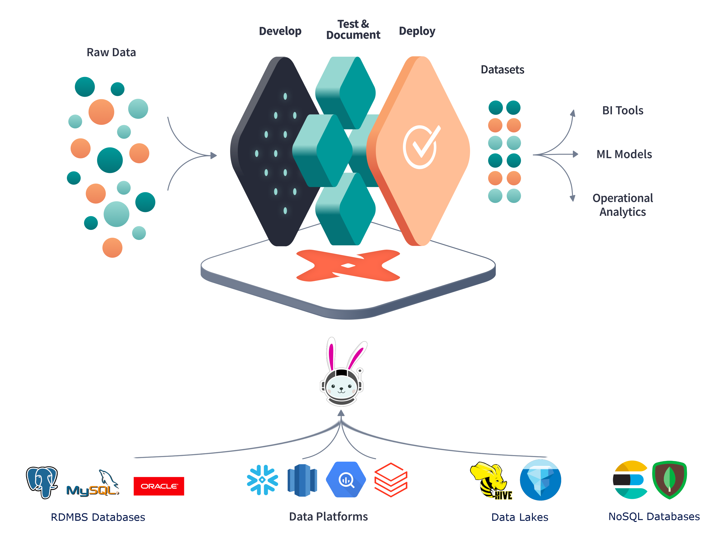

`jaffle_shop` data mesh
==============================

This project has the purpose of showcasing [dbt-trino](https://github.com/findinpath/dbt-trino) dbt adapter functionality
in the context of the `jaffle_shop` `dbt` project in order to showcase how `jaffle_shop` project would look like in a 
_data mesh_ context.

This showcase is inspired by the following two projects:

- [jaffle_shop](https://github.com/dbt-labs/jaffle_shop/) which is showcasing the functionality 
  of [dbt](https://www.getdbt.com/) data warehouse transformation  tool.
- [trino-dbt-demo](https://github.com/victorcouste/trino-dbt-demo) which showcases how to use `dbt` in a scenario where the 
  data to be transformed is found in several databases. See also the associated 
  [blog](https://medium.com/geekculture/trino-dbt-a-match-in-sql-heaven-1df2a3d12b5e) for this project. 


## Introduction

One frequently asked question in the context of using `dbt` tool is: 

> Can I connect my dbt project to two databases?

(see the answered [question](https://docs.getdbt.com/faqs/connecting-to-two-dbs-not-allowed) on the dbt website).

**tldr;** `dbt` stands for transformation as in `T` within `ELT`  pipelines, it doesn't move data from source to a warehouse.

The creators of the `dbt` tool however have added support for handling such scenarios via 
[dbt-presto](https://github.com/dbt-labs/dbt-presto) plugin.

[Trino](https://trino.io/) is a [fork](https://trino.io/blog/2020/12/27/announcing-trino.html) of the popular 
presto high performance, distributed SQL query engine for big data.
This SQL query engine offers a helping hand in performing SQL queries on top of a myriad of data sources.
Trino supports talking to the common relational databases (Postgres, MySQL) and also to data sources
that don't support SQL (AWS S3, Apache Kafka, Apache Cassandra, etc.). Feel free to check
the list of supported Trino [connectors](https://trino.io/docs/current/connector.html) for more details.

By using Trino, there can be queried data from fully separated databases. This makes Trino 
_the analytics engine for data mesh_ (quote from [Starburst Data](https://www.starburst.io/) website).



_dbt Trino Architecture Image taken from [Trino Community Broadcast](https://trino.io/episodes/21.html)_


## jaffle shop data mesh

[Data Mesh](https://www.thoughtworks.com/radar/techniques/data-mesh) is a paradigm to the data engineering domain
which provides an alternative to the common recipe of using a centralized, monolithic data warehouse.

The principles on which this paradigm is being founded are quoted below:

- domain-oriented decentralization of data ownership and architecture 
- domain-oriented data served as a product 
- self-serve data infrastructure as a platform to enable autonomous, domain-oriented data teams 
- federated governance to enable ecosystems and interoperability. 

In the context of the project [jaffle_shop](https://github.com/dbt-labs/jaffle_shop/) there are being used
the domains:

- customers
- orders (customers make orders)
- payments (each completed order has a corresponding payment)


This project provides the answer to the questions answered by the project [jaffle_shop](https://github.com/dbt-labs/jaffle_shop/) 
(which was operating in the centralized data warehouse context) in a _data mesh_ decentralized data warehouse context 
where each domain (customer, order, payment) is being stored in a separate database.
The insights gained from the `dbt` transformations will be also saved in a separate database.


## Local setup

Create a docker network used for test purposes:

```bash
docker network create trino_jaffle_shop_network
```


Spin up the [docker](https://www.docker.com/) environment:

```bash
docker-compose -f ./docker/docker-compose.yaml up -d
```

there will be started the following containers:

- `docker_paymentsdb_1`: contains the payments data in a Postgres database
- `docker_ordersdb_1`: contains the orders data in a Postgres database
- `docker_customersdb_1`: contains the customers data in a Postgres database
- `docker_trino_1`: Trino SQL query engine which maps corresponding catalogs for the three databases mentioned previously and also an `insights` catalog of type `memory` to store the output of `dbt` transformations


The insights gained from analyzing the data mesh, are stored for the purpose of this showcase only on memory, but obviously 
Trino offers the possibility to persist the results of the transformations to a persistent storage as well.


Once the containers are spinned up, there can be made interactions with Trino via Trino CLI:

```bash
docker exec -it docker_trino_1 /usr/bin/trino
```

The catalogs shown should correspond to the databases belonging to the jaffle shop domains:

```sql
trino> show catalogs;
Catalog   
-------------
 customersdb 
 insights    
 ordersdb    
 paymentsdb  
 system      
(5 rows)
```

Here are some basic queries performed on each of the database to make sure that
everything is running as expected:

```sql
trino> select count(*) from customersdb.public.customers;
 _col0 
-------
   100 
(1 row)

Query 20210703_204341_00001_pdadk, FINISHED, 1 node
Splits: 17 total, 17 done (100.00%)
0.32 [1 rows, 0B] [3 rows/s, 0B/s]

trino> select count(*) from ordersdb.public.orders;
 _col0 
-------
    99 
(1 row)

Query 20210703_204405_00002_pdadk, FINISHED, 1 node
Splits: 17 total, 17 done (100.00%)
0.22 [1 rows, 0B] [4 rows/s, 0B/s]

trino> select count(*) from paymentsdb.public.payments;
 _col0 
-------
   113 
(1 row)

Query 20210703_204420_00003_pdadk, FINISHED, 1 node
Splits: 17 total, 17 done (100.00%)
0.22 [1 rows, 0B] [4 rows/s, 0B/s]
```

Now that the access to each of the databases from Trino has been verified, 
there can be built transformations of the Trino virtual data warehouse 
via [dbt-trino](https://github.com/findinpath/dbt-trino) adapter.

This showcase comes with an adapted version of [jaffle_shop](https://github.com/dbt-labs/jaffle_shop/)
which allows performing the `dbt` transformations in a docker container, so there is
no more need to install and configure `dbt` locally.


Build the `dbt-trino-jaffle-shop` docker image:


```
./docker/dbt/build.sh
```

Once the container is built, run the `dbt` transformations from inside a container of the previously built docker image:

```
./docker/insights.sh

Running with dbt=0.20.0
Found 8 models, 20 tests, 0 snapshots, 0 analyses, 146 macros, 0 operations, 0 seed files, 3 sources, 0 exposures

21:41:00 | Concurrency: 1 threads (target='dev')
21:41:00 | 
21:41:01 | 1 of 8 START view model default.stg_orders........................... [RUN]
21:41:01 | 1 of 8 OK created view model default.stg_orders...................... [OK in 0.10s]
21:41:01 | 2 of 8 START view model default.stg_payments......................... [RUN]
21:41:01 | 2 of 8 OK created view model default.stg_payments.................... [OK in 0.08s]
21:41:01 | 3 of 8 START view model default.stg_customers........................ [RUN]
21:41:01 | 3 of 8 OK created view model default.stg_customers................... [OK in 0.07s]
21:41:01 | 4 of 8 START table model default.customer_orders..................... [RUN]
21:41:01 | 4 of 8 OK created table model default.customer_orders................ [OK in 0.52s]
21:41:01 | 5 of 8 START table model default.customer_payments................... [RUN]
21:41:02 | 5 of 8 OK created table model default.customer_payments.............. [OK in 0.48s]
21:41:02 | 6 of 8 START table model default.order_payments...................... [RUN]
21:41:02 | 6 of 8 OK created table model default.order_payments................. [OK in 0.35s]
21:41:02 | 7 of 8 START table model default.dim_customers....................... [RUN]
21:41:02 | 7 of 8 OK created table model default.dim_customers.................. [OK in 0.32s]
21:41:02 | 8 of 8 START table model default.fct_orders.......................... [RUN]
21:41:03 | 8 of 8 OK created table model default.fct_orders..................... [OK in 0.26s]
21:41:03 | 
21:41:03 | Finished running 3 view models, 5 table models in 2.89s.

Completed successfully

Done. PASS=8 WARN=0 ERROR=0 SKIP=0 TOTAL=8

```

Once the `dbt` transformations complete successfully, there can be verified the content of the `insights` Trino catalog :

```bash
docker exec -it docker_trino_1 /usr/bin/trino
```


```
trino> show tables in insights.default;
       Table       
-------------------
 customer_orders   
 customer_payments 
 dim_customers     
 fct_orders        
 order_payments    
 stg_customers     
 stg_orders        
 stg_payments      
(8 rows)

Query 20210918_214153_00126_zb79t, FINISHED, 1 node
Splits: 19 total, 19 done (100.00%)
0.21 [8 rows, 240B] [37 rows/s, 1.09KB/s]


trino> select * from insights.default.dim_customers;
 customer_id | first_order | most_recent_order | number_of_orders | customer_lifetime_value 
-------------+-------------+-------------------+------------------+-------------------------
           1 | 2018-01-01  | 2018-02-10        |                2 |                      33 
           2 | 2018-01-11  | 2018-01-11        |                1 |                      23 
           3 | 2018-01-02  | 2018-03-11        |                3 |                      65 
           4 | NULL        | NULL              |             NULL |                    NULL 
           5 | NULL        | NULL              |             NULL |                    NULL 
           6 | 2018-02-19  | 2018-02-19        |                1 |                       8 
....

```

**NOTE** in the snippet above that the tables:

- `stg_customers`
- `stg_orders`
- `stg_payments`

are actually *views*, virtual tables, whose contents are defined by queries that are actually performed on
external databases via Trino.


By looking at the `dbt` model [dim_customers.sql](docker/dbt/jaffle_shop/models/marts/core/dim_customers.sql)
can be observed that the data corresponding to the domain models:

- customer
- order
- payment

is being joined in order to provide insights across all the aforementioned domain models.

Even though this proof of concept project uses for simplicity Postgres databases to store the data for 
each of the domain models, there is a [myriad](https://trino.io/docs/current/connector.html) of other data sources 
that are supported on Trino and can be joined together.


### Clean up

Clean up the test environment by running the shutting down the docker containers:


```bash
docker-compose -f ./docker/docker-compose.yaml up -d

Stopping docker_customersdb_1 ... done
Stopping docker_trino_1       ... done
Stopping docker_paymentsdb_1  ... done
Stopping docker_ordersdb_1    ... done
Removing docker_customersdb_1 ... done
Removing docker_trino_1       ... done
Removing docker_paymentsdb_1  ... done
Removing docker_ordersdb_1    ... done
Network trino_jaffle_shop_network is external, skipping
```

Remove the docker network 

```bash
docker network rm trino_jaffle_shop_network
```

## Troubleshooting

In case you may be eventually dealing with problems in running this showcase on your workstation,
check out generic information about `dbt` via the command:

```bash
docker run --network=trino_jaffle_shop_network --rm -it --entrypoint sh dbt-trino-jaffle-shop

# dbt debug
Running with dbt=0.20.0
dbt version: 0.20.0
python version: 3.8.11
python path: /usr/local/bin/python
os info: Linux-5.4.0-84-generic-x86_64-with-glibc2.2.5
Using profiles.yml file at /root/.dbt/profiles.yml
Using dbt_project.yml file at /jaffle_shop/dbt_project.yml

Configuration:
  profiles.yml file [OK found and valid]
  dbt_project.yml file [OK found and valid]

Required dependencies:
 - git [OK found]

Connection:
  host: trino
  port: 8080
  user: admin
  database: insights
  schema: default
  Connection test: OK connection ok
```

In case that a `dbt` transformation doesn't successfully run, use the following commands to debug the cause of the issue:

```bash
docker run --network=trino_jaffle_shop_network --rm -it --entrypoint sh dbt-trino-jaffle-shop

# dbt run
...
# cat logs/dbt.log
```


## Conclusion

This proof of concept project gives a quick demo on how to perform `dbt` transformations in the context of a
distributed _Data mesh_.  

Feel free to head over to [Trino](https://trino.io/) website and give it a try in case you may be dealing
with any of the scenarios:

- joining data from different data sources
- joining relational data with data found on AWS S3 (btw. AWS Athena is built on the same technology)

Note that the support for `MERGE` statements in still [in progress](https://github.com/trinodb/trino/issues/7708) in Trino.

In case that this showcase project got you interested, head over to [dbt-trino](https://github.com/findinpath/dbt-trino) project
page and give it a try. Feedback is very much welcome.

## Documentation

- [Data Mesh introductory article](https://martinfowler.com/articles/data-monolith-to-mesh.html)
- [Trino distributed query engine](https://trino.io/)
- [dbt data transformation tool](https://www.getdbt.com/)